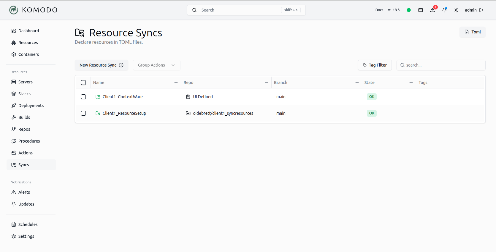
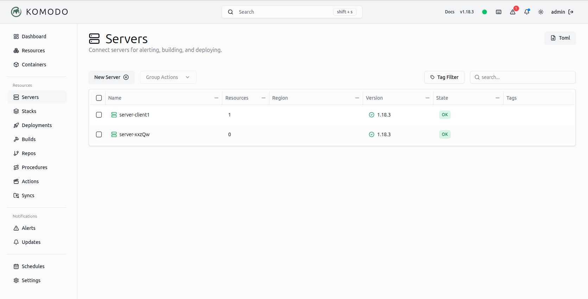
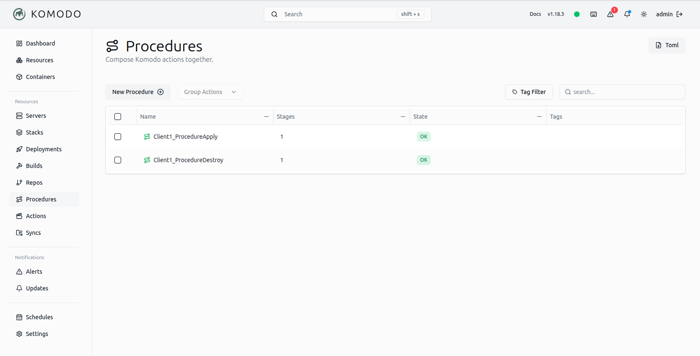
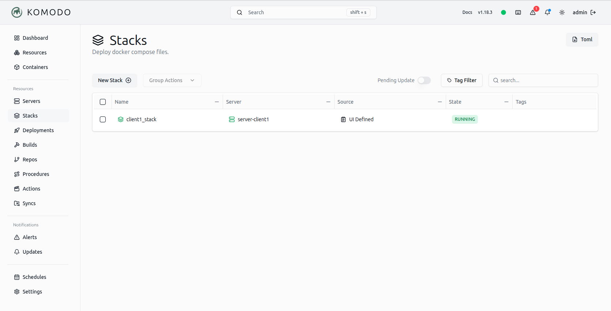
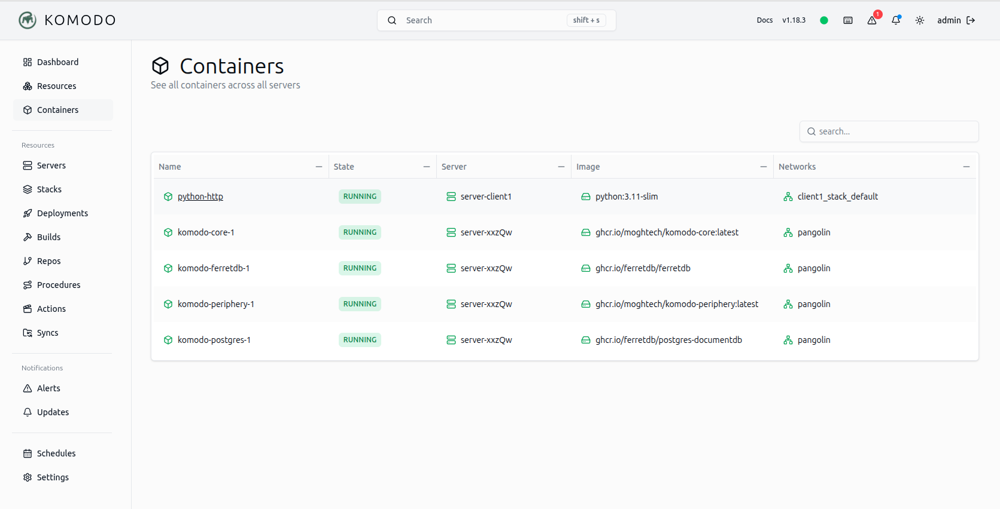

# Hello World Example - Komodo Terraform Provider


## Overview

This example showcases how the Komodo Terraform Provider orchestrates both:
1. Cloud infrastructure (GCP VM instance)
2. Komodo resources (Server, ResourceSync, Stack, Procedure)

It will deploy a simple Python HTTP server in a Docker container on a Google Cloud Platform (GCP) virtual machine.

## How It Works

### Deployment Process (terraform apply)

The deployment process follows these steps:

1. **GCP VM Creation**
   - Creates a Google Cloud VM instance
   - Sets up Docker and necessary dependencies via startup script
   - Installs the Komodo periphery agent for remote management

2. **Komodo Server Resource Creation**
   - Creates a Server resource in Komodo using the public IP address from the GCP VM
   - Establishes connection between Komodo and the periphery agent on the VM

3. **GitHub Repository Setup**
   - Creates a private GitHub repository named `<client_name>_syncresources`
   - Processes the `config-template.toml` file, replacing variables with actual values
   - Uploads the processed file as `resources.toml` to the repository

4. **Resource Sync Configuration (Two-Stage Process)**
   - **Stage 1**: Creates a ContextWare ResourceSync that points to the GitHub repository
   - **Stage 2**: Creates a ResourceSetup ResourceSync that reads the `resources.toml` file and creates the defined resources

5. **Resource Deployment**
   - Runs the ResourceSetup sync to create resources defined in `resources.toml`
   - Creates a Stack resource for the Python HTTP server
   - Creates Procedure resources for application deployment and cleanup
   - Runs the `<client_name>_ProcedureApply` to deploy the Python HTTP server

### Cleanup Process (terraform destroy)

When you run `terraform destroy`, the following happens:

1. **Application Cleanup**
   - Runs the `<client_name>_ProcedureDestroy` to stop and remove the Docker containers
   - Deletes all Komodo resources (Procedures, ResourceSyncs, Server)
   - Deletes the GitHub repository

2. **Infrastructure Cleanup**
   - Terminates the GCP VM instance
   - Removes associated networking resources

## Screenshots



This example demonstrates a minimal setup using the Komodo Terraform Provider to deploy a simple Python HTTP server in a Docker container on a Google Cloud Platform (GCP) virtual machine.


This example shows the server that has been created by komoto


This example shows the procedures that have been created by komoto


This example shows the stack that has been created by komoto


This example shows the container for the Python HTTP server that has been created by komoto

## Komodo Resources Explained

This example creates and manages the following Komodo resources:

### Server
- Represents the connection to the periphery agent running on the GCP VM
- Named `server-<client_name_lowercase>`
- Allows Komodo to remotely manage Docker on the VM

### ResourceSync
Two ResourceSync resources are created:
1. **ContextWare ResourceSync**
   - Named `<client_name>_ContextWare`
   - Points to the GitHub repository containing the `resources.toml` file
   - Defines the source of configuration

2. **ResourceSetup ResourceSync**
   - Named `<client_name>_ResourceSetup`
   - Reads the `resources.toml` file and creates the defined resources
   - Orchestrates the deployment of Stacks and Procedures

### Stack
- Named `<client_name_lowercase>_stack`
- Contains the Docker Compose configuration for the Python HTTP server
- Deployed to the Server resource

### Procedure
Two Procedure resources are created:
1. **Apply Procedure**
   - Named `<client_name>_ProcedureApply`
   - Deploys the Stack to the Server
   - Run automatically during `terraform apply`

2. **Destroy Procedure**
   - Named `<client_name>_ProcedureDestroy`
   - Stops and removes the Stack
   - Run automatically during `terraform destroy`

## Configuration Files

### config-template.toml
This file defines the Komodo resources that will be created. The variables in this file are replaced with actual values from your Terraform configuration before being uploaded to GitHub. In this example, it defines a single Stack with a Docker Compose file for a Python HTTP server.

```toml
[[stack]]
name = "${client_name_lower}_stack"
[stack.config]
server = "server-${client_name_lower}"
file_contents = """
services:
  python-http:
    image: python:3.11-slim
    container_name: python-http
    working_dir: /app
    command: python -m http.server 80
    ports:
      - "80:80"
    restart: unless-stopped
"""

[[procedure]]
name = "${client_name}_ProcedureApply"
description = "This procedure runs the stack deployment"

[[procedure.config.stage]]
name = "${client_name}_Stack"
enabled = true
executions = [
  { execution.type = "DeployStack", execution.params.stack = "${client_name_lower}_stack", execution.params.services = [], enabled = true }
]

[[procedure]]
name = "${client_name}_ProcedureDestroy"
description = "This procedure destroys the stack deployment"

[[procedure.config.stage]]
name = "${client_name}_Stack"
enabled = true
executions = [
  { execution.type = "DestroyStack", execution.params.stack = "${client_name_lower}_stack", execution.params.services = [], execution.params.remove_orphans = false, enabled = true }
]

```

You will notice the variables in the file are replaced with actual values from your Terraform configuration before being uploaded to GitHub. This is why we need an interim step to process the template file and replace the variables with actual values before uploading it to GitHub.

### startup-script.sh
This script is executed on the GCP VM during instance creation. It installs Docker, the Komodo periphery agent, and any other dependencies.

```bash
#!/bin/bash
set -e

# Log all output to a file for debugging
exec > >(tee /var/log/user-data.log) 2>&1

echo "Starting user data script execution at $(date)"

# Update system packages
apt-get update

# Install required packages
apt-get install -y \
  ca-certificates \
  curl \
  gnupg \
  lsb-release \
  git \
  postgresql-client

# Add Docker's official GPG key
install -m 0755 -d /etc/apt/keyrings
curl -fsSL https://download.docker.com/linux/ubuntu/gpg | gpg --dearmor -o /etc/apt/keyrings/docker.gpg
chmod a+r /etc/apt/keyrings/docker.gpg

# Add Docker repository
echo \
"deb [arch=\"$(dpkg --print-architecture)\" signed-by=/etc/apt/keyrings/docker.gpg] https://download.docker.com/linux/ubuntu \
\"$(. /etc/os-release && echo \"$VERSION_CODENAME\")\" stable" | \
tee /etc/apt/sources.list.d/docker.list > /dev/null

# Update package index with Docker repository
apt-get update -y

# Install Docker
apt-get install docker-ce docker-ce-cli containerd.io docker-buildx-plugin docker-compose-plugin -y

# Add ubuntu user to docker group
usermod -aG docker ubuntu

# Activate the new group membership
newgrp docker

echo "Starting komodo periphery at $(date)"

# Run setup script for komodo periphery
curl -sSL https://raw.githubusercontent.com/moghtech/komodo/main/scripts/setup-periphery.py | sudo python3

# Enable periphery service
systemctl enable periphery

echo "User data script finished at $(date)"
```


### main.tf
Defines the Terraform resources to create, including:
- GCP VM instance
- Komodo provider configuration
- Komodo user resource with templated configuration

### variables.tf
Defines the variables used in the Terraform configuration, including:
- GCP credentials and project settings
- Instance configuration
- Komodo provider endpoint and GitHub token

## Getting Started

1. **Copy the example variables file**
   ```bash
   cp terraform.tfvars.example terraform.tfvars
   ```

2. **Edit the variables file with your values**
   - GCP project ID and credentials
   - Komodo provider endpoint
   - GitHub token

3. **Initialize Terraform**
   ```bash
   terraform init
   ```

4. **Apply the configuration**
   ```bash
   terraform apply
   ```

5. **Access the Python HTTP server**
   After deployment completes, you can access the server at:
   ```
   http://<instance_public_ip>:80
   ```

6. **Clean up when finished**
   ```bash
   terraform destroy
   ```

## Key Implementation Details

The selected code snippet shows how the ResourceSync is configured:

```
"file_contents": "[[resource_sync]]\nname = \"%s_ResourceSetup\"\n[resource_sync.config]\nrepo = \"GITHUBNAME/%s_syncresources\"\ngit_account = \"GITHUBNAME\"\nresource_path = [\"resources.toml\"]"
```

This creates a ResourceSync that:
1. Points to the GitHub repository containing the `resources.toml` file
2. Specifies the path to the resources file
3. Uses the GitHub account specified in the configuration

The two-stage ResourceSync process allows for flexible configuration:
- First stage: Upload the processed configuration to GitHub
- Second stage: Use that configuration to create the actual resources

This approach enables declarative management of Komodo resources through Terraform.

